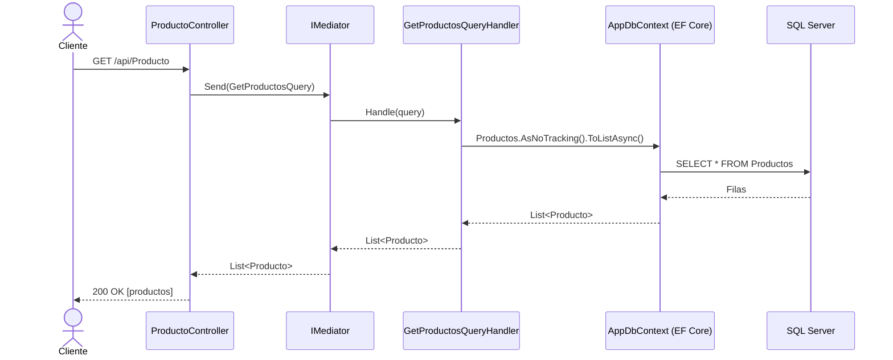
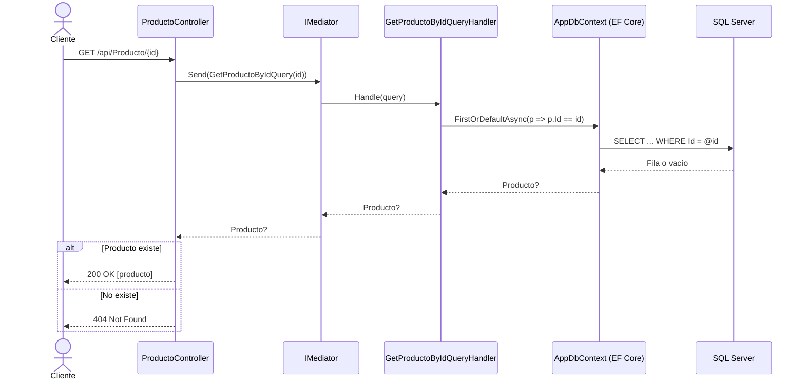
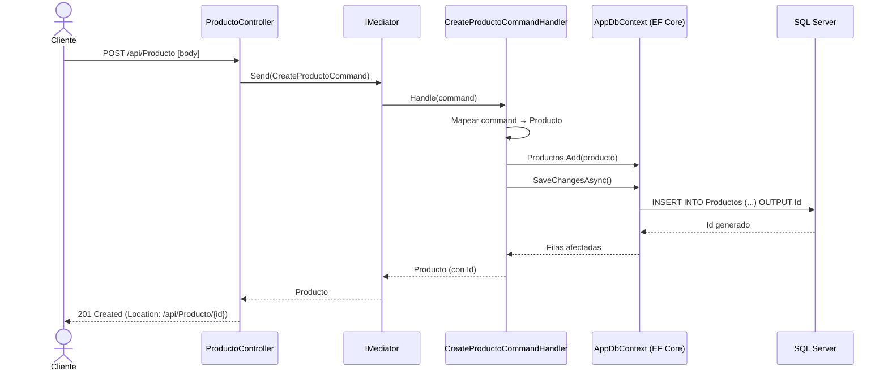
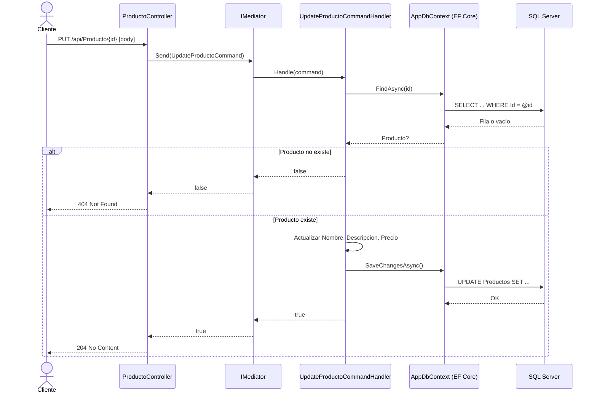
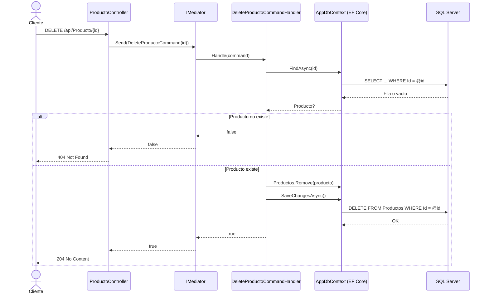
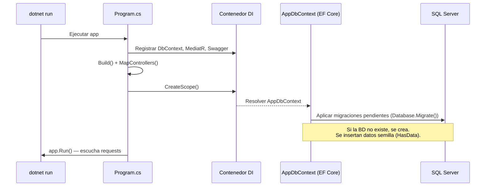

# API - Productos (aaw-unidad2)

## Descripción

API RESTful construida con **ASP.NET Core (.NET 10)** que implementa un CRUD completo de productos sobre **SQL Server** utilizando **Entity Framework Core** y el patrón **CQRS** con **MediatR** para separar comandos (escrituras) de consultas (lecturas). Las migraciones se aplican automáticamente al iniciar la aplicación y la documentación interactiva se expone mediante **Swagger UI**.

### Stack

| Tecnología | Uso |
|---|---|
| ASP.NET Core Web API | Framework HTTP |
| Entity Framework Core 10 | ORM |
| SQL Server (LocalDB) | Base de datos |
| MediatR 12 | CQRS (comandos y consultas) |
| Swashbuckle | Swagger UI / documentación |

## Endpoints

Base URL: `https://localhost:<puerto>/api`

| Método | Ruta | Descripción | Respuestas |
|---|---|---|---|
| GET | `/api/Producto` | Lista todos los productos | 200 |
| GET | `/api/Producto/{id}` | Obtiene un producto por Id | 200, 404 |
| POST | `/api/Producto` | Crea un producto | 201, 400 |
| PUT | `/api/Producto/{id}` | Actualiza un producto existente | 204, 404 |
| DELETE | `/api/Producto/{id}` | Elimina un producto | 204, 404 |

Documentación interactiva: `https://localhost:<puerto>/swagger` (solo en desarrollo).

### Ejemplo de payload

```json
{
  "id": 0,
  "nombre": "Teclado",
  "descripcion": "Teclado mecánico RGB",
  "precio": 89.99
}
```

## Conexiones externas

- **SQL Server**: configurada en `appsettings.json` bajo `ConnectionStrings:DefaultConnection`.
  ```json
  "ConnectionStrings": {
    "DefaultConnection": "Server=(localdb)\\mssqllocaldb;Database=ApiDb;Trusted_Connection=True;MultipleActiveResultSets=true;TrustServerCertificate=True"
  }
  ```
  Modificar si se usa SQL Server Express u otra instancia.

- **Swagger UI** (`/swagger`): documentación generada a partir de los controladores.

## Estructura del proyecto

```
Api/
├── Controllers/
│   └── ProductoController.cs      # Endpoints REST (delegan en MediatR)
├── Features/
│   └── Productos/
│       ├── Commands/              # CQRS - escrituras
│       │   ├── CreateProductoCommand.cs
│       │   ├── UpdateProductoCommand.cs
│       │   └── DeleteProductoCommand.cs
│       └── Queries/               # CQRS - lecturas
│           ├── GetProductosQuery.cs
│           └── GetProductoByIdQuery.cs
├── Models/
│   └── Producto.cs                # Entidad de dominio
├── Data/
│   └── AppDbContext.cs            # DbContext + seed de datos
├── Migrations/                    # Migraciones EF Core
└── Program.cs                     # Configuración y arranque
```

## Diagramas de secuencia

### GET - Listar todos los productos



### GET - Obtener producto por Id



### POST - Crear producto



### PUT - Actualizar producto



### DELETE - Eliminar producto



### Arranque de la aplicación



## Cómo ejecutar

```bash
dotnet restore
dotnet run
```

Las migraciones (creación de tablas y datos semilla) se aplican automáticamente al iniciar. Luego abrir `https://localhost:<puerto>/swagger`.
